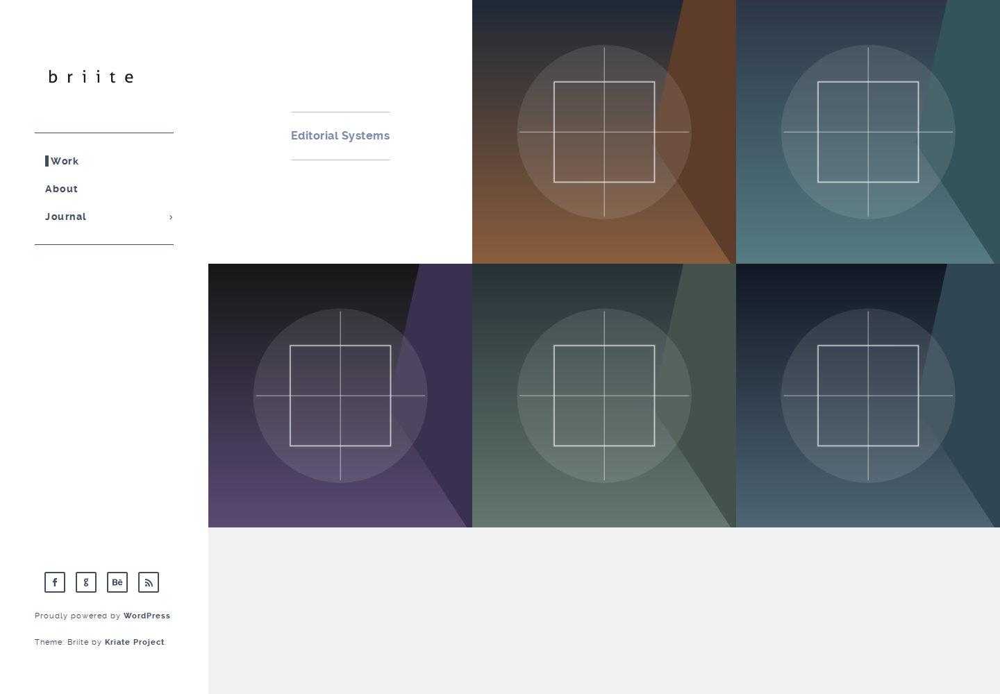
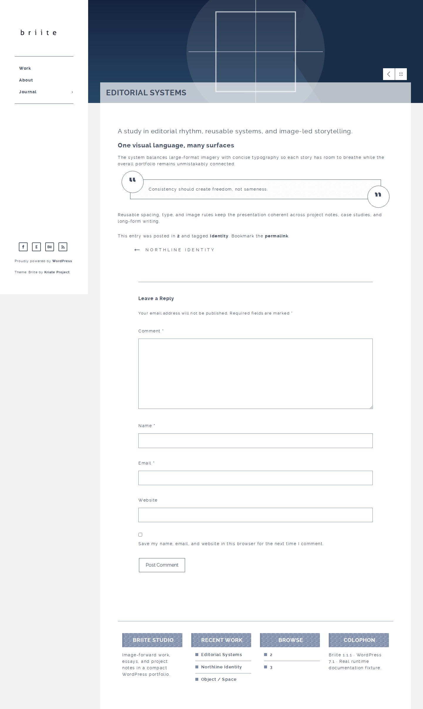
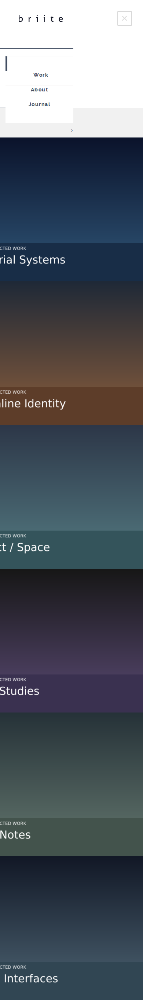
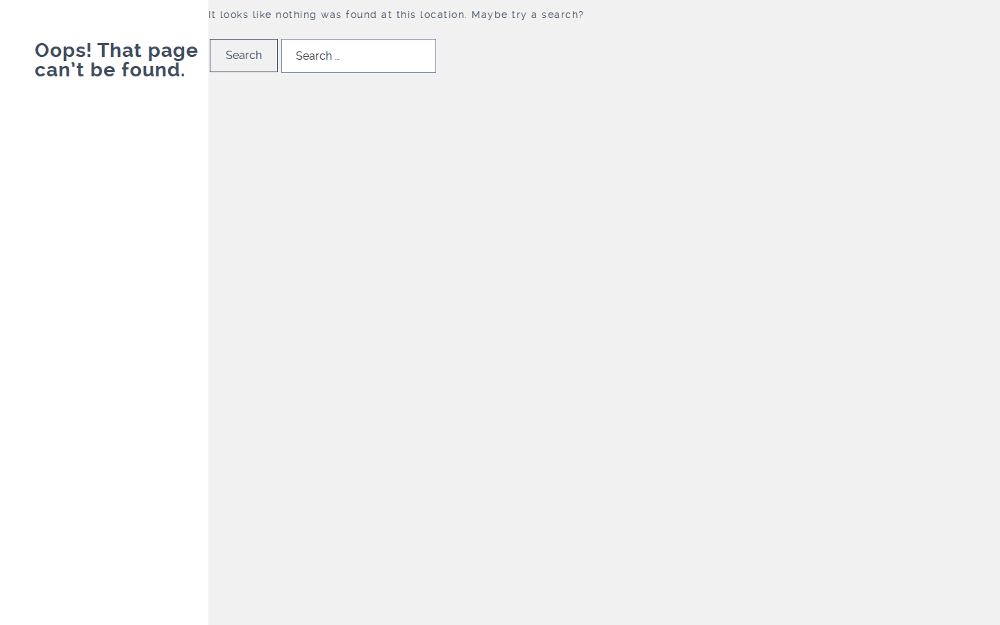

# Briite

Briite is a lightweight classic WordPress portfolio theme for image-forward work, editorial projects, case studies, and visual publishing. The 1.1.1 release modernizes the original Briite codebase for current WordPress and PHP while deliberately preserving the established layout, fixed navigation rail, content model, widget IDs, Customizer data, and visual identity.



## What Briite includes

- Image-forward portfolio/blog grid with dedicated 450×450 `briite-grid-thumb` crops.
- Single-project/post presentation with a 1300×500 featured-image banner, category return control, and previous/next navigation.
- Fixed desktop navigation rail with responsive mobile menu behavior and nested-menu support.
- WordPress Custom Header support using Briite's established logo dimensions and default artwork.
- One Primary Menu location with preserved menu assignments across upgrades.
- Four historical footer widget areas: Widget 1 through Widget 4.
- Featured images, automatic feed links, responsive embeds, title-tag support, HTML5 markup, threaded comments, galleries, and captions.
- Post-format support for aside, image, video, quote, and link posts.
- Search results, category/archive templates, pagination, page templates, and a useful 404 recovery screen with WordPress search.
- Custom background support and a real RTL stylesheet that mirrors Briite's established layout.
- Editor styles that bring Briite typography/content treatment into the WordPress editor without forcing a block-theme redesign.
- Translation-ready strings under the `briite` text domain with CI-protected POT compatibility.
- Jetpack Infinite Scroll compatibility using Briite's real `#content` stream.
- Keyboard navigation, skip-link behavior, focus-visible/focus-within menu handling, ARIA navigation semantics, and reduced-motion support.
- Local Bootstrap 3.3.7 CSS, local Raleway font files, and local theme assets. No required runtime CDN, companion plugin, analytics service, or external font service.
- Upgrade-safe fallback to already-generated historical `single-banner` and `grid-thumb` media derivatives when canonical `briite-*` derivatives do not yet exist.

## Real runtime screenshots

These images are captured from the packaged Briite theme running on the same WordPress 7.1.1 runtime used by the repository's compatibility gate. They are not mockups.

| Surface | Screenshot |
| --- | --- |
| Portfolio home, desktop |  |
| Single project/post |  |
| Responsive navigation |  |
| 404 search recovery |  |

The canonical WordPress theme-directory `screenshot.png` is regenerated from the same real runtime at exactly 1200×900.

## Compatibility

| Requirement | Briite 1.1.1 |
| --- | --- |
| WordPress | Requires 5.9, tested through 7.1 |
| PHP | Requires 7.4, CI covers 7.4 through 8.5 |
| Theme type | Classic WordPress theme |
| Editor | Classic + block editor content editing with Briite editor styles |
| RTL | Supported |
| Translation | Translation-ready |
| License | GPLv2 or later |

## Installation

1. Download or build the Briite release ZIP.
2. In WordPress, open **Appearance → Themes → Add New → Upload Theme**.
3. Upload `briite-1.1.1.zip`, install it, and activate Briite.
4. Assign your existing menu to **Primary Menu** if WordPress has not already preserved the assignment.
5. Add content to **Widget 1** through **Widget 4** if you use the bottom widget region.
6. Set featured images on portfolio/posts to populate the grid and single-item hero treatment.

Existing Briite installations keep their established menu location, widget IDs, Customizer/theme-mod data, featured images, attachment data, and stored user metadata.

## Release profiles

Briite has two deterministic package profiles with the same active theme runtime, templates, JavaScript, settings, content model, and visual identity:

- **Consumer package:** preserves the historical Bootstrap Glyphicons payload and isolated `inc/legacy-compat.php` aliases for downstream compatibility.
- **WordPress.org package:** removes the unused Glyphicons payload and generic legacy callback aliases so the directory artifact satisfies stricter bundled-font and public-namespace rules without changing Briite's active behavior.

## Documentation

- [Complete feature and behavior reference](docs/FEATURES.md)
- [Screenshot provenance and regeneration](docs/SCREENSHOTS.md)
- [WordPress.org-facing readme](readme.txt)
- [License](LICENSE.txt)

## Development and verification

Production changes are expected to clear the repository's exact-head quality gates. The current gate set covers PHP syntax, PHP 7.4–8.5 compatibility, WordPress Coding Standards, JavaScript syntax, consumer packaging, WordPress.org packaging, translation contracts, runtime route rendering, required theme contracts, and WordPress runtime diagnostics.

Useful commands:

```bash
composer install
composer lint
composer phpcompat
composer package
bash tools/build-wordpress-org-release.sh
```

Documentation screenshots can be reproduced with the dedicated workflow and capture scripts described in [docs/SCREENSHOTS.md](docs/SCREENSHOTS.md).

## Project principles

Briite 1.1 is a compatibility-focused continuation of the existing theme, not a replacement product. Modernization work should preserve the recognizable Briite experience unless a change is required for WordPress compatibility, accessibility, security, packaging, or a proven runtime defect.

Copyright 2014–2026 Agustealo Johnson. Briite is distributed under the GNU General Public License v2 or later.
